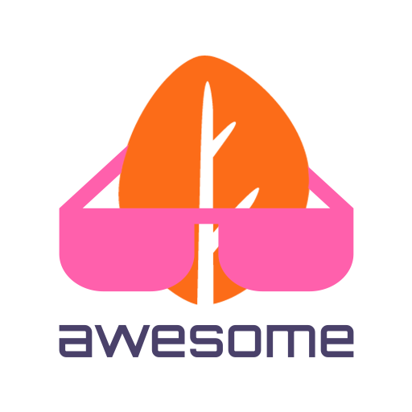

   
  
   

## Awesome OctoberCMS
> A curated list of awesome things related to OctoberCMS.

[October](https://octobercms.com) is a Content Management System (CMS) and web platform whose sole purpose is to make your development workflow simple again.

## Contents

- [Latest News](#latest-news)
- [Official Resources](#official-resources)
- [External Resources](#external-resources)
- [Community](#community)
- [Plugins](#plugins)
- [Themes](#themes)
- [Tools](#tools)
- [Tutorials](#tutorials)
- [Mention of OctoberCMS](#mention-of-octobercms)
- [Blogs](#blogs)
- [Docker](#docker)
- [Official Examples](#official-examples)
- [Community Examples](#community-examples)
- [Open source projects using OctoberCMS](#open-source-projects-using-octobercms)
- [Projects Using OctoberCMS](#projects-using-octobercms)

### Latest News
- [Laravel 9 Integration Has Begun!](https://octobercms.com/blog/post/laravel-9-integration-has-begun) - We are happy to let you know that we started integrating Laravel 9 into October CMS.

### Official Resources

- [Official Website](https://octobercms.com/)
- [Official Guide 2.x](https://docs.octobercms.com/2.x/setup/installation.html)
- [Official Guide 1.x](https://docs.octobercms.com/1.x/setup/installation.html)
- [Release Notes](https://octobercms.com/support/articles/release-notes)
- [OctoberCMS Plugins](https://octobercms.com/plugins)
- [OctoberCMS Themes](https://octobercms.com/themes)
- [GitHub Repository](https://github.com/octobercms/october)

### External Resources

- [OctoberCMS Tricks](https://octobertricks.com/) - October CMS resources and help articles
- [OctoberCMS Show Cases](https://octobershowcases.com/) - This site is created to showcase websites made with OctoberCMS
- [OctoberCMS Jobs](https://octobercmsjobs.com/) - Hire expert OctoberCMS developers & find job offers

### Community

- [YouTube](https://www.youtube.com/c/OctoberCMSOfficial)
- [Twitter](https://twitter.com/octobercms)
- [Discord](https://discord.gg/3jfN9SZxMr)
- [Telegram, English community](https://t.me/octoberchat)
- [Telegram, Russian community](https://t.me/octobercms_rus)
- [Russian community forum](https://octoclub.ru)

### Plugins

Discover the full list of OctoberCMS plugins on https://octobercms.com/plugins

#### Official
- [User](https://octobercms.com/plugin/rainlab-user) - Front-end user management.
- [Blog](https://octobercms.com/plugin/rainlab-blog) - A robust blogging platform.
- [Forum](https://octobercms.com/plugin/rainlab-forum) - A simple embeddable forum.
- [Location](https://octobercms.com/plugin/rainlab-location) - Adds location based features, such as Country and State.
- [Translate](https://octobercms.com/plugin/rainlab-translate) - Enables multi-lingual websites and translate website contents.
- [Sitemap](https://octobercms.com/plugin/rainlab-sitemap) - Generate a sitemap.xml file for your website.
- [Notify](https://octobercms.com/plugin/rainlab-notify) - Notification engine and services.
- [Static Pages](https://octobercms.com/plugin/rainlab-pages) - Adds static pages, menus and breadcrumbs features to OctoberCMS.

#### Community

###### E-commerce
- [Shopaholic](https://octobercms.com/plugin/lovata-shopaholic) - E-commerce platform for October CMS
- [Mall](https://octobercms.com/plugin/offline-mall) - E-commerce solution for October CMS

### Themes

Discover the full list of OctoberCMS themes on https://octobercms.com/themes

#### Official

- [Vanilla](https://octobercms.com/theme/rainlab-vanilla) - A plain starter template that implements account management, a blog and community forum.
- [Relax](https://octobercms.com/theme/rainlab-relax) - A fictional site that demonstrates how to build a client-friendly website.
- [Bonjour](https://octobercms.com/theme/rainlab-bonjour) - A sample multi-lingual theme for translated content.

#### Community
- [Bootstrap 5 - Starter Kit](https://octobercms.com/theme/prismify-bootstrap-starter-kit) - Starter theme based on Bootstrap 5 with SASS and Laravel Mix.

### Tools

- [Builder](https://octobercms.com/plugin/rainlab-builder) - Create a fully functional plugin scaffold in a matter of minutes
- [Deploy](https://octobercms.com/plugin/rainlab-deploy) - A simple way to deploy your application to a remote location.

### Tutorials

[oc-v1-label]: media/oc-v1-label.svg "OctoberCMS v1"
[oc-v2-label]: media/oc-v2-label.svg "OctoberCMS v2"

> The labels show the OctoberCMS versions that were available at that time.

![OctoberCMS v1][oc-v1-label] = OctoberCMS version **1.x**
 
![OctoberCMS v2][oc-v2-label] = OctoberCMS version **2.x**

**Tutorials published in:**

#### 2019
![OctoberCMS v1][oc-v1-label]
- [Getting started with October CMS and Static Pages - v.2](https://octobercms.com/blog/post/getting-started-october-cms-static-pages-v2)
- [Running October on AWS - Part 2](https://octobercms.com/blog/post/running-october-aws-part-2)
- [Running October on AWS - Part 1](https://octobercms.com/blog/post/running-october-aws-part-1)
- [Watch and Learn - Vue, Vuex and October CMS App](https://octobercms.com/support/article/ob-23)

#### 2018
![OctoberCMS v1][oc-v1-label]
- [Watch and Learn video series](https://octobercms.com/support/article/ob-18)

#### 2017
![OctoberCMS v1][oc-v1-label]
- [Collection of third party resources](https://octobercms.com/support/article/ob-22)
- [Beyond Behaviors - Part 3: Implementing a nested relationship](https://octobercms.com/support/article/ob-21)
- [Beyond Behaviors - Part 2: Rendering Lists and Forms by hand](https://octobercms.com/support/article/ob-20)
- [Beyond Behaviors - Part 1: How MVC works in October CMS](https://octobercms.com/support/article/ob-19)

#### 2016
![OctoberCMS v1][oc-v1-label]
- [Advanced content marketing and analytics](https://octobercms.com/blog/post/advanced-content-marketing-and-analytics)
- [Setting up a local environment with Vagrant](https://octobercms.com/blog/post/setting-local-october-cms-environment-vagrant-configuration-tutorial)
- [Building a responsive multi-language website (Part 2)](https://octobercms.com/blog/post/building-responsive-multi-language-website-blog-and-static-pages-using-october-cms-part-2)
- [Building a responsive multi-language website (Part 1)](https://octobercms.com/blog/post/building-responsive-multi-language-website-blog-and-static-pages)
- [Using October without a database](https://octobercms.com/support/article/ob-13)
- [Rapid Application Development with Builder](https://octobercms.com/support/article/ob-12)

#### 2015
![OctoberCMS v1][oc-v1-label]
- [Back-end Relations](https://octobercms.com/support/article/ob-11)
- [Media Manager Introduction](https://octobercms.com/support/article/ob-8)
- [Building client-friendly websites](https://octobercms.com/blog/post/building-client-friendly-websites)

#### 2014
![OctoberCMS v1][oc-v1-label]
- [Extending the User plugin](https://octobercms.com/support/article/ob-10)
- [Translating Content, Messages and Models](https://octobercms.com/support/article/ob-9)
- [Static Pages - Content Blocks and Placeholders](https://octobercms.com/blog/post/static-pages-content-blocks-and-placeholders)
- [Getting started with Static Pages](https://octobercms.com/blog/post/getting-started-static-pages)
- [Mastering Components](https://octobercms.com/blog/post/mastering-components)
- [Building a simple weather plugin](https://octobercms.com/blog/post/building-the-weather-plugin)
- [Building a blog and forum](https://octobercms.com/blog/post/building-a-blog-and-forum)
- [Introduction to October](https://octobercms.com/support/article/ob-7)

### Mention of OctoberCMS

-

### Blogs

#### Official

[Official OctoberCMS blog](https://octobercms.com/blog) of core team members Alexey Bobkov and Samuel Georges.

#### Community

-

### Docker

- [octobercms/docker](https://github.com/octobercms/docker) - Official Docker Image for October CMS

### Official Examples

- [octobercms/test-plugin](https://github.com/octobercms/test-plugin) - Playground for October CMS

### Community Examples

-

### Open source projects using OctoberCMS

![OctoberCMS v2][oc-v2-label]

| Name | Description | Repository |
|---|---|---|

![OctoberCMS v1][oc-v1-label]

| Name | Description | Repository |
|---|---|---|

### Projects using OctoberCMS

-

> Please don't hesitate to make a PR if you have more resources to share.

## License
[MIT license](https://opensource.org/licenses/MIT)
